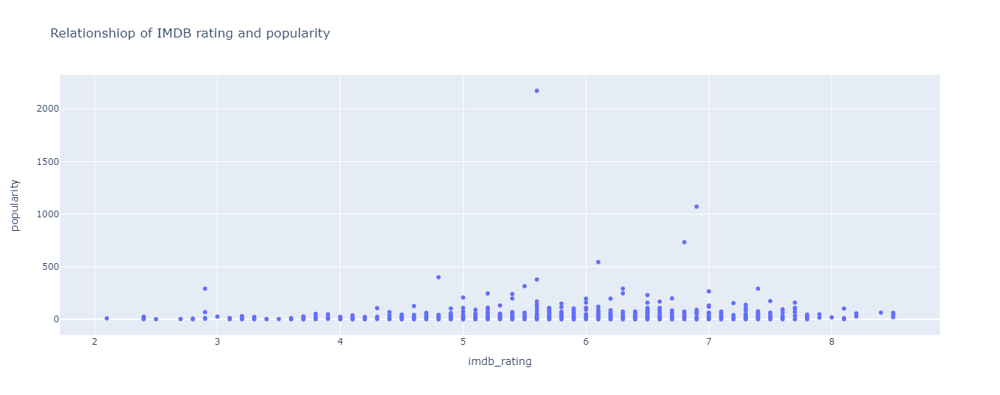
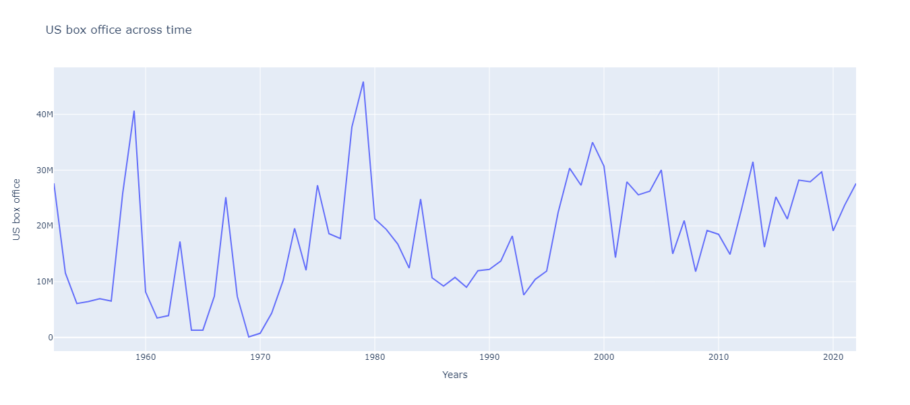
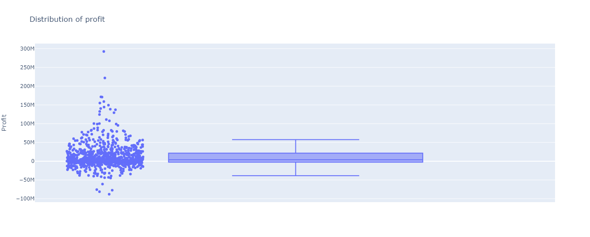
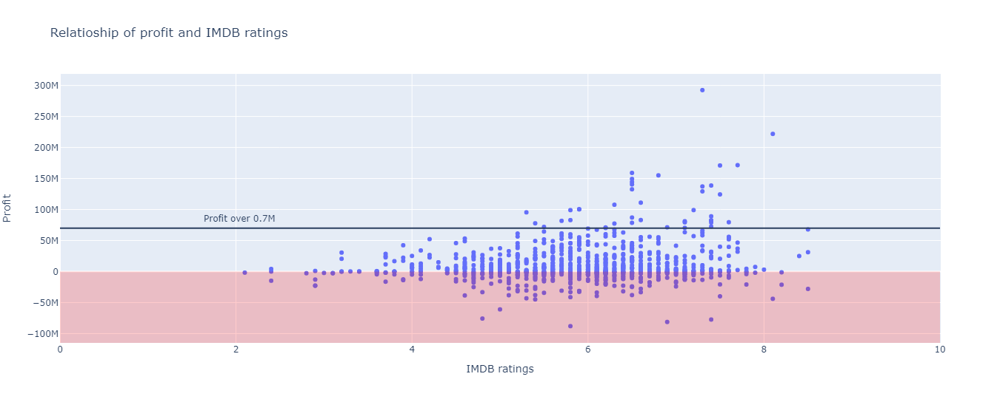
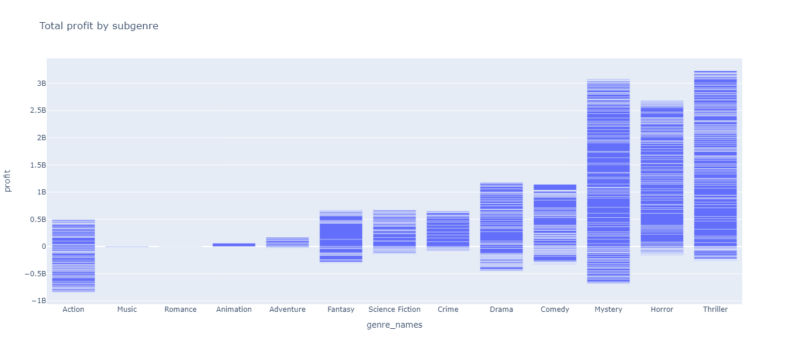

# horror_movies

## Introduction
In this project the task was to find a data set and insert more information scraped out of the internet via BeautifulSoup or an API. 

## Description
The database chosen from Kaggle was Horror Movies, found at https://www.kaggle.com/datasets/evangower/horror-movies. The data related to budgets and revenue was very incomplete. In order to enrich this information different scrapes were attempted searching for directors, streaming pricing, streaming availability, awards for horror genre and more quantitative finantial data. 

After aquiring the information available, changes were made to datatypes, standardization of value units, creation of new columns to facilitate different views.

The exploration through the data had no fixed question attached.  

## Tecnologies
For this project seven different libraries were used: 
- Requests
- BeautifulSoup
- Pandas
- Seaborn
- Matplotlib
- JSon 
- Plotly (modules: express, graph_objects, io)

## Conclusions
The attempts to scrape data from The Numbers, Rotten Tomatoes, Saturn Awards, WatchMode(via API) all failed due to various reasons. Also, important information such as Metascore and Directors were also unvailable in IMDB page. Aquiring DATA for the topic MOVIES is a very difficult task without paying for an API.

### PLOTS
The plots below are the result of the exploration.

In this scatter plot it is shown that popularity and IMBD rating  have no clear relationship for HORROR movies.

Here is the US box office (revenue) across a period of 50 years.

From there visualize how the profit is distributed. 

Then we explore the relationship between IMDB ratings and profit. Profits above US$ 1M have a IMDB score superior to 6.  

And in the final plot it is shown the most profitable subgenres in HORROR.

## Launch
1. Git clone this repo;
2. Run `main.ipynb` file